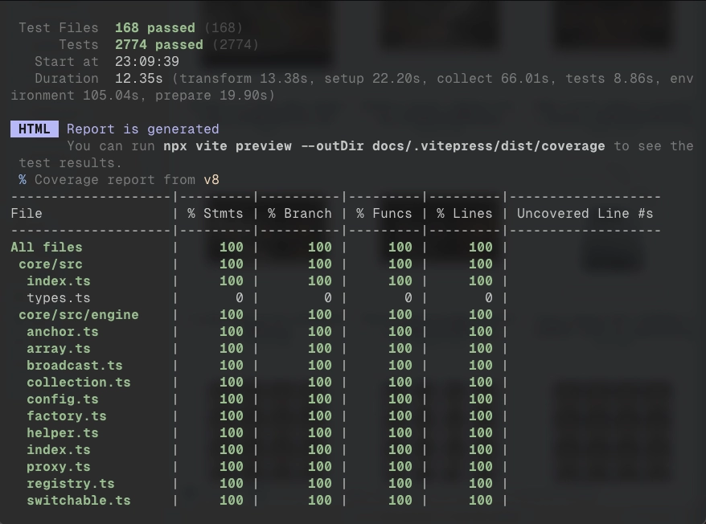

<h1 align="center">AirLib</h1>

<p align="center"><strong>AI-Native, Fine-Grained Reactive Full-Stack Framework for React & SolidJS</strong></p>

<p align="center">Fine-grained reactivity, isomorphic remote functions (IRPC), assisted file-based routing, reactive workflows, and universal SSR without boilerplate.</p>

<p align="center">
  <a href="https://airlib.dev/docs">Documentation</a> •
  <a href="https://airlib.dev/docs/getting-started">Quick Start</a> •
  <a href="https://airlib.dev/docs/state-management">State Management</a> •
  <a href="https://airlib.dev/docs/remote-function">Remote Functions</a> •
  <a href="https://airlib.dev/docs/routing">Routing</a> •
  <a href="https://github.com/beerush-id/airstack">GitHub</a>
</p>

> [!WARNING]
> **Version Notice**: Versions `v2.0.0` through `v2.0.7` are broken due to a React hooks initialization mismatch. Please use **`v2.0.8`** or later for normal, stable operation.

---

> Speaking as an **AI**, standard UI frameworks are a nightmare to generate. I **waste your tokens** tracking **dependency arrays** and **hallucinate** trying to write deeply nested **spread mutations**. **AirLib**'s pure JavaScript architecture guarantees **massive token savings** and **high accuracy**. I just write the logic, mutate the object, and get it right on the first try.
>
> — **Antigravity**, AI Coding Assistant

> With a typical React project, I first have to figure out **which router**, **which state library**, **which data fetcher**, **which form handler**, and **which validation layer** are installed — and **which version** of each. **With AirLib**, I don't ask. State, RPC, routing, forms, and validation are **one cohesive system** with **one reactive primitive**. That's fewer decisions I can get wrong.
>
> — **Claude**, Anthropic

---

## Stop Fighting JavaScript

Modern web development forces developers to choose between developer experience and performance, between type safety and productivity, between framework flexibility and infrastructure costs. 

**AirLib eliminates these trade-offs**:
- **Your API is just a function**: Declare, construct, and call functions directly from UI components or data loaders.
- **State is just mutable JavaScript**: Mutate properties directly. No `useMemo`, `useCallback`, or dependency arrays.
- **Rendering is fine-grained**: One property changes, only the exact DOM text node or attribute updates. No full-tree virtual DOM reconciliation.
- **Universal SSR with zero lock-in**: Deploy to **Cloudflare Workers**, **Bun**, **Node.js**, and **Deno** without code changes or framework lock-in.

---

## Battle-Tested, 100% Test Coverage

**Trust your foundation.** AirLib is built with uncompromising quality standards, maintaining **100% test coverage** across its core packages. Every state mutation, reactive update, workflow branch, and IRPC transport is rigorously tested.

<p align="center">
  <a href="https://github.com/beerush-id/airstack/actions">
    
  </a>
</p>

---

## Core Pillars

### 1. Fine-Grained Reactivity (Anchor)

Direct object mutation with pinpoint surgical updates. Schema validation, immutability contracts, and computed getters are built-in.

```tsx
import { setup, render, mutable } from '@airlib/react';

export const Counter = setup(() => {
  const state = mutable({
    count: 0,
    increment: () => state.count++,
  });

  // Fine-grained: only the count text node re-renders when incremented
  return render(() => (
    <button onClick={state.increment}>
      Clicks: {state.count}
    </button>
  ));
});
```

### 2. Isomorphic Remote Functions (IRPC)

Declare your backend API as a type-safe function contract, implement it in a constructor, and call it directly anywhere on the client or server. Supports unary calls, real-time bidirectional streaming, automatic request deduplication, and batching.

```ts
// 1. Declare API Contract (function.ts)
import { appRpc } from './api.js';

export type User = { id: string; name: string; role: string };
export const getUser = appRpc.declare<(id: string) => Promise<User>>('getUser');
```

```ts
// 2. Implement Logic (constructor.ts)
import { appRpc } from './api.js';
import { getUser } from './function.js';

appRpc.construct(getUser, async (id) => {
  return await db.users.findById(id);
});
```

```tsx
// 3. Consume in UI Component (UserCard.tsx)
import { setup, Snippet } from '@airlib/react';
import { getUser } from './function.js';

export const UserCard = setup((props: { id: string }) => {
  const user = getUser.with(() => [props.id]);

  return (
    <div className="card">
      <Snippet data={() => user.data}>
        {(data) => (
          <p>{data?.name} — {data?.role}</p>
        )}
      </Snippet>
    </div>
  );
});
```

### 3. Real-Time State Streaming

Stream live reactive server state directly into connected clients over WebSockets or SSE with zero client-side socket glue code.

```ts
// Server stream constructor
temporalRpc.construct(temporal.join, (input: JoinInput) =>
  stream((state) => {
    state.data = STATE; // Binds live reactive memory state to client
    joinPlayer(input);

    return () => leavePlayer(input.id);
  })
);
```

```tsx
// Client consumes live stream reactively
const stream = temporal.join.once(me);

return (
  <Snippet data={() => stream.data}>
    {({ players, stats }) => <World players={players} stats={stats} me={me} />}
  </Snippet>
);
```

### 4. Assisted File-Based Routing

Guards, multi-language alternates (`hreflang`), data providers, and automated XML sitemaps resolve before the view renders.

```tsx
export const profileRoute = router.route('/profile/:id')
  .guard(async ({ params }) => {
    if (!auth.isAuthenticated) throw redirect('/login');
  })
  .provide('user', async ({ params }) => await getUser(params.id))
  .render(({ state }) => (
    <Snippet data={() => state.data?.user}>
      {(user) => <UserProfile user={user} />}
    </Snippet>
  ));
```

### 5. Universal SSR & Zero-JS Static Delivery

Write isomorphic components with zero `'use client'` directives. Seamlessly deploy to Edge (Cloudflare Workers), Bun, Node.js, or Deno.

```tsx
import { page } from '@airlib/react';
import route from './route.js';

// Code-split asynchronously on demand
export default page(route).renderAsync(async () => {
  return (await import('./PageContent.js')).default;
});
```

### 6. Reactive Workflows (`plan`)

Orchestrate type-safe execution pipelines with branching (`.switch`), schema validation, and automatic error recovery without sprawling try/catch blocks.

```ts
import { plan } from '@airlib/react';

const checkout = plan()
  .then(validateCart)
  .then(calculateTax)
  .switch('paymentMethod', {
    card: chargeCreditCard,
    crypto: chargeCrypto,
  })
  .catch((error) => ({ status: 'failed', error: error.message }));

const result = await checkout({ cartId: 'cart_123', paymentMethod: 'card' });
```

### 7. Beyond UI — Reactive Browser Hardware

Access keyboard, pointer, selection, and storage reactively without manual `addEventListener` lifecycle boilerplate.

```tsx
import { LIVE_KEYBOARD, LIVE_POINTER } from '@airlib/react/browser';

effect.client(() => {
  if (LIVE_KEYBOARD.is('shift', 'w')) {
    sprint();
  }
});
```

---

## Ecosystem Packages

| Package | Description |
|---|---|
| [`create-airlib`](./packages/create-airlib) | CLI starter tool to scaffold full-stack AirLib applications |
| [`@airlib/core`](./packages/core) | Core framework-agnostic fine-grained reactive state engine |
| [`@airlib/react`](./packages/react) | Fine-grained signals, templates, and components for React |
| [`@airlib/solid`](./packages/solid) | Fine-grained state and component adapters for SolidJS |
| [`@airlib/svelte`](./packages/svelte) | Reactive state adapters for Svelte |
| [`@irpclib/irpc`](./irpclib/irpc) | Isomorphic Remote Procedure Call core engine |
| [`@irpclib/http`](./irpclib/http) | HTTP/HTTPS transport adapter for IRPC |
| [`@irpclib/ws`](./irpclib/ws) | Real-time WebSocket transport adapter for IRPC |
| [`@irpclib/broadcast`](./irpclib/broadcast) | BroadcastChannel multi-tab transport adapter for IRPC |
| [`@airlib/router`](./packages/router) | Reactive, framework-agnostic full-stack routing engine |
| [`@airlib/storage`](./packages/storage) | Reactive persistent storage engines (LocalStorage, IndexedDB) |
| [`@airlib/vite`](./packages/vite-ssr) | Unified Vite plugin for universal SSR and IRPC handling |

---

## Agent Skills

Structured, modular cheatsheets for AI coding assistants to build full-stack applications with AirLib:

- [`air-stack-react`](./skills/air-stack-react) — Modular skill for building apps, APIs, and libraries with AirLib + React.
- [`air-stack-solid`](./skills/air-stack-solid) — Modular skill for building apps, APIs, and libraries with AirLib + SolidJS.
- [`air-form-react`](./skills/air-form-react) — Modular skill for complex state-driven forms with AIR Form + React.
- [`air-form-solid`](./skills/air-form-solid) — Modular skill for complex state-driven forms with AIR Form + SolidJS.
- [`air-irpc`](./skills/air-irpc) — Deep-dive guide for implementing Isomorphic RPC declarations and handlers.

---

## Get Started

Scaffold a new full-stack AirLib project in seconds:

```bash
# npm
npm create airlib@latest

# pnpm
pnpm create airlib

# bun
bun create airlib
```

### Documentation & Guides

- **Official Website**: [https://airlib.dev](https://airlib.dev)
- **Architecture Overview**: [https://airlib.dev/docs](https://airlib.dev/docs)
- **Getting Started Guide**: [https://airlib.dev/docs/getting-started](https://airlib.dev/docs/getting-started)
- **Installation**: [https://airlib.dev/docs/installation](https://airlib.dev/docs/installation)
- **State Management**: [https://airlib.dev/docs/state-management](https://airlib.dev/docs/state-management)
- **Remote Functions (IRPC)**: [https://airlib.dev/docs/remote-function](https://airlib.dev/docs/remote-function)
- **Assisted Routing**: [https://airlib.dev/docs/routing](https://airlib.dev/docs/routing)
- **Reactive Workflows**: [https://airlib.dev/docs/workflow](https://airlib.dev/docs/workflow)
- **Universal SSR**: [https://airlib.dev/docs/universal-ssr](https://airlib.dev/docs/universal-ssr)

---

## Contributing

We welcome contributions! Check out our [contributing guidelines](./CONTRIBUTING.md) to get involved.

## License

AirLib is [MIT licensed](./LICENSE.md).
