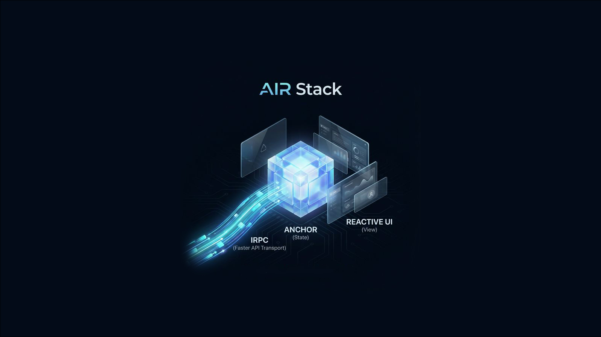

<h1 align="center">AIR Stack</h1>

<p align="center">AI-Native, Full-Stack TypeScript Architecture</p>

<p align="center">
  
</p>

<p align="center">Unify fine-grained reactivity, isomorphic RPC, state management, routing, reactive workflows, and universal SSR into one cohesive, zero-boilerplate system.</p>

## Stop Fighting JavaScript

JavaScript is not bad, it just needs a little touch. Modern web development forces you to choose between developer experience and performance, between type safety and productivity, between framework flexibility and infrastructure costs. AIR Stack eliminates these trade-offs by letting JavaScript handle what it's good at, and letting the rendering engine handle what it's good at.

## Core Architecture

AIR Stack is a revolutionary approach to building web applications, unifying the stack under a cohesive, AI-Native architecture.

### 1. Fine-Grained Reactive State (Anchor)
Direct mutation with fine-grained reactivity. Schema validation, immutability contracts, and computed properties are built in. Whether it's a live data stream, a global user session, or a complex form, it's just reactive state. One field changes, one fragment updates. Everything else stays still.

```tsx
import { setup, render } from '@anchorlib/react';
import { mutable } from '@anchorlib/core';

export const Counter = setup(() => {
  const state = mutable({ count: 0 });
  const inc = () => state.count++;

  // Fine-grained updates: only the text node re-renders.
  return render(() => <button onClick={inc}>{state.count}</button>);
});
```

### 2. Reactive, Isomorphic RPC (IRPC)
Declare a function, implement it, call it. IRPC abstracts HTTP, WebSocket, and BroadcastChannel into a single function call. Automatic batching, request coalescing, and network caching happen seamlessly outside the UI loop.

```tsx
// 1. Declare the remote stream
export const watchPrice = irpc.declare<(ticker: string) => number>({ name: 'watchPrice' });

// 2. Call it directly in your view. Types and data sync automatically.
export const PriceCard = setup(({ ticker }) => {
  const price = watchPrice.with(() => [ticker]);
  
  return render(() => <div>${price.data}</div>);
});
```

### 3. Reactive Workflows
Orchestrate type-safe, reactive execution pipelines with schema validation, branching, and error recovery. Create complex, multi-step asynchronous operations anywhere JavaScript runs without massive try/catch blocks.

```ts
// Compose the pipeline once with branching and error recovery
const checkout = plan()
  .then(calculateTotal)
  .switch('method', { card: chargeCard, paypal: chargePaypal })
  .catch((err) => ({ error: 'Checkout Failed' }));

// Execute it anywhere
const receipt = await checkout({ cartId: '123', method: 'card' });
```

### 4. Reactive Routing
Guards and data providers execute *before* the view renders. The route reacts to the state, not just the URL, and route state automatically re-evaluates when its dependencies change. No more imperative redirects or scattered guard logic.

```tsx
export const userRoute = router.route('/user/:id')
  .guard(() => { 
    if (!auth.isAuthenticated) throw redirect('/login'); 
  })
  .provide('profile', async ({ params }) => await getUser(params.id))
  .render((state) => (
    <div>{state.data?.profile.name}</div>
  ));
```

### 5. Universal SSR
One render function deploys to Bun, Node.js, Cloudflare Workers, and Deno. No `'use client'` directives. Anchor restricts state to the request scope, handling concurrency and cookie mutations across any JS runtime without forcing architectural splits.

```tsx
// 1. Write isomorphic components without 'use client' directives
export const Dashboard = setup(() => {
  const session = mutable({ user: 'Alice' });
  return render(() => <h1>Welcome, {session.user}</h1>);
});

// 2. Render instantly across Bun, Node, CF Workers, or Deno
const html = await renderToString(<Dashboard />);
```

### 6. AI-Native by Design
Token saving and high accuracy by design. Pure JavaScript mechanics mean zero context bloat, zero hallucinated hooks, and instant right-first-time generation for AI coding assistants.

```ts
// AI doesn't need to hallucinate dependency arrays or spread mutations.
// Just pure JavaScript.
const toggleTheme = () => {
  profile.theme = profile.theme === 'dark' ? 'light' : 'dark';
};
```

## Components

### Anchor: State Management
The heart of the ecosystem. Anchor provides fine-grained reactivity, flexible state primitives, and a comprehensive toolkit for managing application state.
- [@anchorlib/core](./packages/core) - Framework-agnostic reactive state
- [@anchorlib/react](./packages/react) - React integration
- [@anchorlib/solid](./packages/solid) - SolidJS integration
- [@anchorlib/svelte](./packages/svelte) - Svelte integration
- [@anchorlib/vue](./packages/vue) - Vue integration
- [@anchorlib/storage](./packages/storage) - Persistent storage engines
- [@anchorlib/router](./packages/router) - Reactive routing engine

### IRPC: Type-Safe API Layer
Isomorphic Remote Procedure Call framework bridging frontend state and backend data.
- [@irpclib/irpc](./irpclib/irpc) - Core framework with automatic batching
- [@irpclib/http](./irpclib/http) - HTTP transport implementation
- [@irpclib/ws](./irpclib/ws) - WebSocket transport implementation
- [@irpclib/broadcast](./irpclib/broadcast) - BroadcastChannel transport

## Get Started

**Documentation**: [https://airlib.dev](https://airlib.dev)

**Quick Start Guides:**
- [AIR Stack Overview](https://airlib.dev/overview)
- [Anchor Getting Started](https://airlib.dev/getting-started)
- [IRPC Documentation](https://airlib.dev/irpc/index.html)
- [Framework-Specific Guides](https://airlib.dev/react/getting-started)

**Resources:**
- [GitHub Repository](https://github.com/beerush-id/anchor)
- [Contributing Guidelines](./CONTRIBUTING.md)
- [IRPC Specification](https://airlib.dev/irpc/specification)

## Support and Contributions

If you need help, have found a bug, or want to contribute, please see our [contributing guidelines](./CONTRIBUTING.md). We appreciate and value your input.

Star the project if you find it valuable and stay tuned for upcoming updates.

## License

AIR Stack is [MIT licensed](./LICENSE.md).
