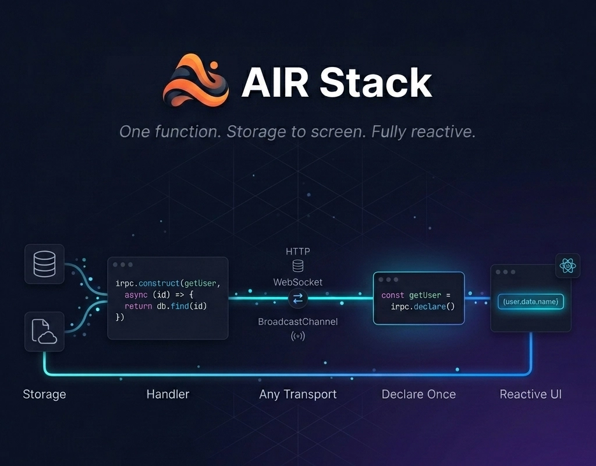

<h1 align="center">AIR Stack</h1>

<p align="center">AI-Native, Full-Stack TypeScript Architecture</p>

<p align="center">
  
</p>

<p align="center">Full-stack architecture with fine-grained reactivity, reactive and isomorphic RPC, reactive routing, reactive workflows, and universal SSR without boilerplate.</p>

> Speaking as an **AI**, standard UI frameworks are a nightmare to generate. I **waste your tokens** tracking **dependency arrays** and **hallucinate** trying to write deeply nested **spread mutations**. **AIR Stack**'s pure JavaScript architecture guarantees **massive token saving** and **high accuracy**. I just write the logic, mutate the object, and get it right on the first try.
>
> — **Antigravity**, AI Coding Assistant

> With a typical React project, I first have to figure out **which router**, **which state library**, **which data fetcher**, **which form handler**, and **which validation layer** are installed — and **which version** of each. **With AIR Stack**, I don't ask. State, RPC, routing, forms, and validation are **one system** with **one reactive primitive**. That's fewer decisions I can get wrong.
>
> — **Claude**, Anthropic

## Stop Fighting JavaScript

**JavaScript is not bad**, it just **needs a little touch**. Modern web development forces you to choose between developer experience and performance, between type safety and productivity, between framework flexibility and infrastructure costs. **AIR Stack** eliminates these trade-offs by letting **JavaScript** handle what it's good at, and letting the **rendering engine** handle what it's good at.

## Core Architecture

**AIR Stack** is a revolutionary approach to **building web applications**, unifying the stack under a cohesive, **AI-Native architecture**.

### 1. Fine-Grained Reactive State (Anchor)
**Direct mutation** with **fine-grained reactivity**. Schema **validation**, **immutability** contracts, and computed properties are built in. Whether it's a **live data stream**, a global **user session**, or a **complex form**, it's just **reactive state**. One field changes, one fragment updates. Everything else stays still.

```tsx
export const Counter = setup(() => {
  const state = mutable({ 
    count: 0,
    increment: () => state.count++
  });

  // Fine-grained updates: only the text node re-renders.
  return render(() => <button onClick={state.increment}>{state.count}</button>);
});
```

### 2. Reactive, Isomorphic RPC (IRPC)
Declare a **function**, implement it, **call** it. IRPC abstracts **HTTP**, **WebSocket**, and **BroadcastChannel** into a **single function call**. Automatic **batching**, request **coalescing**, and **network caching** happen seamlessly **outside the UI loop**.

```tsx
// Declare the remote function
export type GetUserFn = (id: string) => Promise<User | undefined>;
export const getUser = irpc.declare<GetUserFn>({
  name: 'getUser'
});

// You can call it directly in your route provider.
profileRoute.provide('user', async ({ params }) => {
  return await getUser(params.user_id);
});

// You can call it directly in your components, with type-safe arguments and data. Function re-run when prop changes.
export const ProfileCard = setup((props) => {
  const user = getUser.with(() => [props.id]);
  
  return (
    <>
      <Show when={() => user.status === 'pending'}>Please wait...</Show>
      <Show when={() => user.data}>
        {({ name, email }) => (
          <p>Name: {name}, Email: {email}</p>
        )}
      </Show>
    </>
  );
});
```

### 3. Reactive Workflows
Orchestrate **type-safe**, **reactive** execution **pipelines** with **schema validation**, **branching**, and **error recovery**. Create **complex**, **multi-step** asynchronous **operations** anywhere JavaScript runs without massive try/catch blocks.

```ts
// Compose the pipeline once with branching and error recovery
const checkout = plan()
  .then(calculateTotal)
  .switch('method', { card: chargeCard, paypal: chargePaypal })
  .catch((err) => ({ error: 'Checkout Failed' }));

// Execute it anywhere
const receipt = await checkout({ cartId: '123', method: 'card' });
```

### 4. Reactive Routing
**Guards** and data **providers** execute *before* the view renders. The route **reacts to the state**, not just the URL, and route state automatically **re-evaluates** when its dependencies change. No more imperative redirects or scattered guard logic.

```tsx
export const userRoute = router.route('/user/:id')
  .guard(() => { 
    if (!auth.isAuthenticated) throw redirect('/login'); 
  })
  .provide('profile', async ({ params }) => await getUser(params.id))
  .render(({ state }) => (
    <Show when={() => state.data?.profile}>
      {({ name, email }) => (
        <p>Name: {name}, Email: {email}</p>
      )}
    </Show>
  ));
```

### 5. Universal SSR
**One render** function deploys to **Bun**, **Node.js**, **Cloudflare Workers**, and **Deno**. No `'use client'` directives. Anchor restricts state to the request scope, handling **concurrency** and **cookie mutations** across any JS runtime without forcing architectural splits.

```tsx
// Write isomorphic React components without 'use client' directives
export const Dashboard = setup((props) => {
  const settings = cookies('settings', { theme: 'light' });

  // All child components can get settings from getContext('settings');
  setContext('settings', settings);

  return (
    <main>
      <h1>Welcome!</h1>
      {props.children}
    </main>
  );
});

// Render on Browser
createRoot(document.getElementById('app')).render(<Dashboard />);

// Render on Server (Bun, Node, CF Workers, or Deno)
const html = await renderToString(<Dashboard />);
```

### 6. AI-Native by Design
**Token saving** and **high accuracy** by design. Pure JavaScript mechanics mean **zero context bloat**, **zero hallucinated** hooks, and **instant right-first-time** generation for **AI coding assistants**.

```ts
// AI doesn't need to hallucinate dependency arrays, memoization, stale state, or spread mutations. Just pure JavaScript.
const toggleTheme = () => {
  settings.theme = settings.theme === 'dark' ? 'light' : 'dark';
};
```


## Components

### Anchor: State Management
The heart of the ecosystem. Anchor provides fine-grained reactivity, flexible state primitives, and a comprehensive toolkit for managing application state.
- [@anchorlib/core](./packages/core) - Framework-agnostic reactive state
- [@anchorlib/react](./packages/react) - React integration
- [@anchorlib/solid](./packages/solid) - SolidJS integration
- [@anchorlib/svelte](./packages/svelte) - Svelte integration

### IRPC: Type-Safe API Layer
Isomorphic Remote Procedure Call framework bridging frontend state and backend data.
- [@irpclib/irpc](./irpclib/irpc) - Core framework with automatic batching
- [@irpclib/http](./irpclib/http) - HTTP transport implementation
- [@irpclib/ws](./irpclib/ws) - WebSocket transport implementation
- [@irpclib/broadcast](./irpclib/broadcast) - BroadcastChannel transport

### Router: Reactive, Framework-Agnostic Router
Guards and data providers resolve before rendering. Route state re-evaluates when dependencies change — no imperative redirects or scattered guard logic.
- [@anchorlib/router](./packages/router) - Reactive routing engine

### Storage: Reactive, Browser Storage Engine
Persistent state across sessions, tabs, and storage limits. Reactive wrappers for localStorage, sessionStorage, and IndexedDB.
- [@anchorlib/storage](./packages/storage) - Persistent storage engines

### Vite Integration
SSR rendering and IRPC routing as a single Vite plugin. Deploys to Bun, Node.js, Cloudflare Workers, and Deno.
- [@anchorlib/vite-ssr](./packages/vite-ssr) - Vite plugin for SSR rendering and IRPC routing

### Agent Skills
Structured instructions for AI coding assistants to build applications, APIs, and libraries using AIR Stack.
- [air-stack-react](./skills/air-stack-react) - Modular skill for building apps, APIs, and libraries with AIR Stack and React

## Get Started

**Documentation**: [https://airlib.dev](https://airlib.dev)

**Quick Start Guides:**
- [Overview](https://airlib.dev/overview)
- [Installation](https://airlib.dev/installation)
- [Getting Started](https://airlib.dev/getting-started)

**Architecture:**
- [State Management](https://airlib.dev/state-management/index.html)
- [Remote Function](https://airlib.dev/remote-function/index.html)
- [Workflows](https://airlib.dev/workflow/index.html)
- [Routing](https://airlib.dev/routing/index.html)
- [User Interface](https://airlib.dev/ui/index.html)

**Framework Guides:**
- [React](https://airlib.dev/react/getting-started)
- [SolidJS](https://airlib.dev/solid/getting-started)
- [Svelte](https://airlib.dev/svelte/getting-started)

**Resources:**
- [GitHub Repository](https://github.com/beerush-id/anchor)
- [Contributing Guidelines](./CONTRIBUTING.md)
- [IRPC Specification](https://airlib.dev/irpc/specification)

## Support and Contributions

If you need help, have found a bug, or want to contribute, please see our [contributing guidelines](./CONTRIBUTING.md). We appreciate and value your input.

Star the project if you find it valuable and stay tuned for upcoming updates.

## License

AIR Stack is [MIT licensed](./LICENSE.md).
